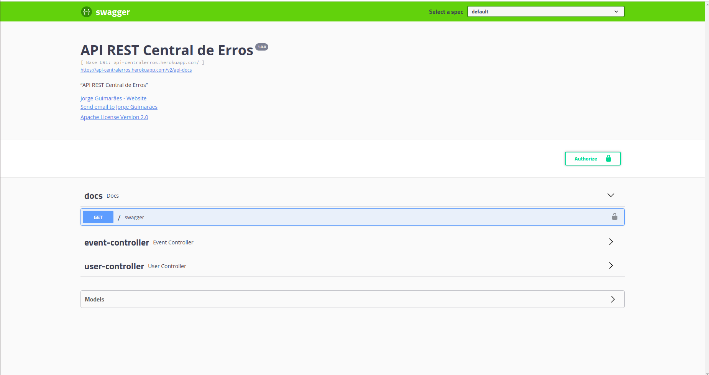
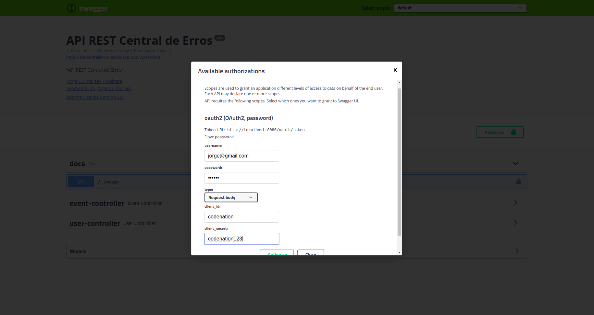
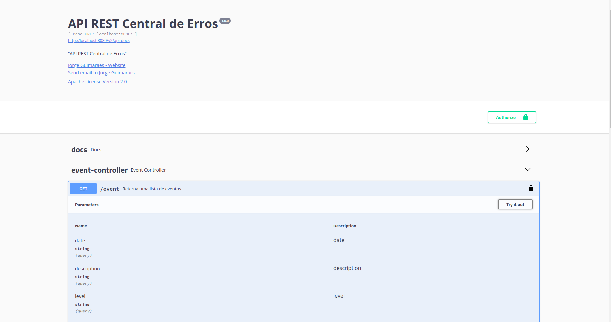

# Central-Erros-Api
Projeto Final do curso java online da Codenation.
Em projetos modernos é cada vez mais comum o uso de arquiteturas baseadas em serviços ou microsserviços. Nestes ambientes complexos,
erros podem surgir em diferentes camadas da aplicação (backend, frontend, mobile, desktop) e mesmo em serviços distintos. Desta forma,
é muito importante que os desenvolvedores possam centralizar todos os registros de erros em um local, de onde podem monitorar e tomar 
decisões mais acertadas. Neste projeto vamos implementar uma API Rest para centralizar registros de erros de aplicações.


## Tecnologia

- [Java](https://www.oracle.com/technetwork/java/javase/downloads/index.html) ```1.8```
- [Spring Boot](https://spring.io/projects/spring-boot) ```2.1.6.RELEASE```
- [Maven](https://maven.apache.org/) ```3.6.2```
- [Postgres](https://www.postgresql.org/) ```10.9``` 
- [Swagger](https://swagger.io/) ```2.9.2```


## Documentação
https://api-centralerros.herokuapp.com

## Deploy

Para fins de demonstração de funcionamento, foi feito o deploy da aplicação na plataforma [Heroku](https://api-centralerros.herokuapp.com)

### Endpoint

## User
- https://api-centralerros.herokuapp.com/user (metodo POST, insere um usuário)
- https://api-centralerros.herokuapp.com/user (metodo GET, retorna todos usuários)

## Event
- https://api-centralerros.herokuapp.com/event  (metodo POST, insere um event e seus logs)
- https://api-centralerros.herokuapp.com/event  (metodo GET, retorna todos event )
- https://api-centralerros.herokuapp.com/event/{id}   (metodo GET, retorna um event com seus logs)

Obs: Use a aplicação através do swagger no endereço https://api-centralerros.herokuapp.com para testar aplicação, segue os dados de **username**=jorge@gmail.com, **password**=123456, **client_id**=codenation and **client_secret**=codenation123 para autorizar a requisição.

####Exemplo:

##### Autorização


##### Form


##### Resources



